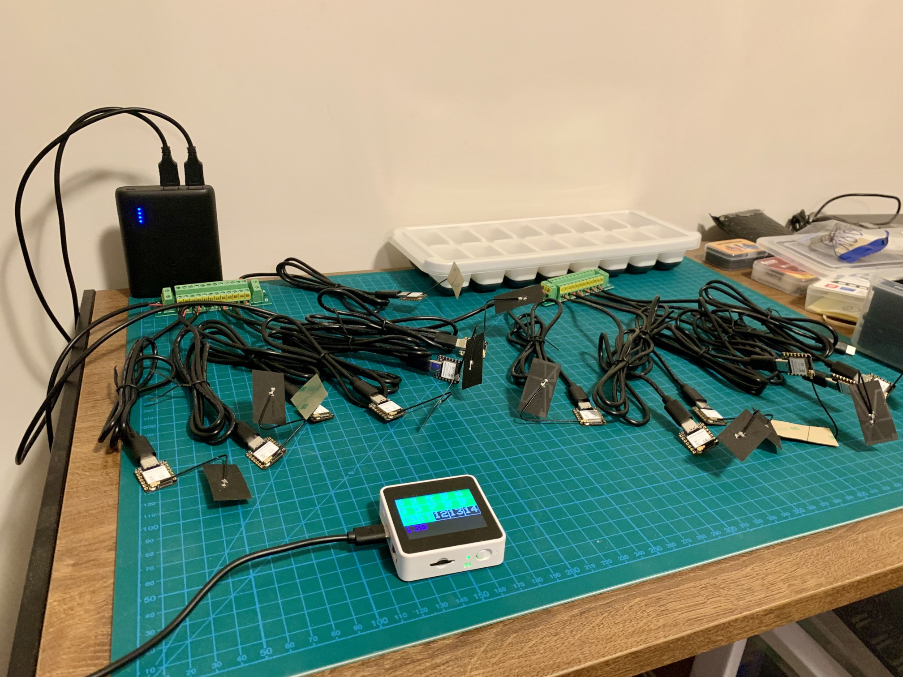
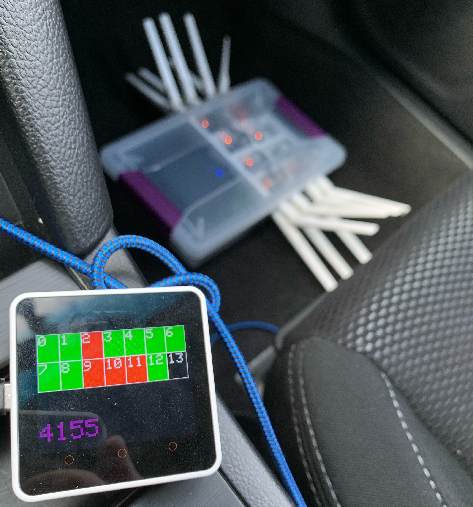

# rattagatta

# About the Project

This repo represents phase 1 of 3 of a larger overarching objective.

You can read about the nuance, design, and objectives here:
* [https://www.labs.greynoise.io/grimoire/2024-03-01-rattagatta/](https://www.labs.greynoise.io/grimoire/2024-03-01-rattagatta/)





# Hardware

| Component                               | Link                                                                                             | Recommended Quantity |
|-----------------------------------------|--------------------------------------------------------------------------------------------------|----------------------|
| M5Stack Core2 ESP32 IoT Development Kit | https://shop.m5stack.com/products/m5stack-core2-esp32-iot-development-kit?variant=35960244109476 | 1                    |
| Seeed Studio XIAO ESP32-S3              | https://www.seeedstudio.com/XIAO-ESP32S3-p-5627.html                                             | 15                   |
| 2.4GHz Rod Antenna for XIAO ESP32-S3    | https://www.seeedstudio.com/2-4GHz-2-81dBi-Antenna-for-XIAO-ESP32C3-p-5475.html                  | 14                   |
| MicroSD Card w/ <= 16GB Capacity        | https://www.amazon.com/Brand-SanDisk-Class-Micro-Memory/dp/B01FDBLC0C/                           | 1                    |


"Recommended Quantity" refers to the amounts of each item that should be purchased to directly replicate this project and scale as was carried out by the author. If only one of each component is purchased without any changes to hardware, the code will still compile, run, and demonstrate the project. It just will not be efficient.

# Setup

`rg-collector` and `rg-logger` are PlatformIO projects targetting the XIAO ESP32-S3('s) and the M5Stack Core2 ESP32 respectively.

You must install PlatformIO before following the build steps:
* https://platformio.org/install/ide?install=vscode

I utilize several different libraries inthe codebase and set some build flags. PlatformIO projects are ✨magic✨ and will automatically download and configure everything as specificed.

`rg-loader` is a Golang module that handles reading and wrangling the data logged to the MicroSD card into a SQLite database for easy queries/transforms/exports/portability into formats you may wish to consume with other tooling. It is not intended to be a feature complete loader, but simply a way to get from point A to point B utilizing a language with strict error handling. You are encouraged to write your own loader, but be aware that you should expect a corrupted or malformed log item to occur at a rate of ~1/5000 for reasons that are completely out of scope of this project.

# Building/Flashing `rg-collector`

Hardware Target: `Seeed Studio XIAO ESP32-S3`

1. Open `rg-collector` folder in PlatformIO IDE, wait for libraries to install etc...
2. Connect `Seeed Studio XIAO ESP32-S3` via USB
3. Open `platformio.ini`
4. PlatformIO -> Project Tasks -> Upload

If you have completed the steps above, already have the PlatformIO IDE open, and wish to flash more than one collector:
1. Connect `Seeed Studio XIAO ESP32-S3` into USB
2. Open `src/main.cpp`
3. Find `const int channel = 1; // WiFi Channel number between 1 and 13` at the top of the file.
4. Increment the channel by 1
6. Do the same for `const char *ssid = "BLEAKEST01"; // SSID Name`
5. PlatformIO -> Project Tasks -> Upload

This will spread out the WiFi channels as used for communication between devices and reduce interference. You will experience radio gremlins if you do not do this.

The device will restart and **do absolutely nothing notable** until a running `rg-logger` initializes it. This is by design.

## Collector OTA Update

After the collector has been flashed at least once, OTA updates are possible.

Connect to the relevant WiFi collector @ `BLEAKEST01`, build the firmware, upload via the web interface at:
* `http://192.168.4.1/serverIndex`

Alternatively, using curl via:

```bash
curl -vvv 'http://192.168.4.1/update' -X POST -F "update=@firmware.bin"
```

# Building/Flashing `rg-logger`

Hardware Target: `M5Stack Core2 ESP32`

1. Open `rg-logger` folder in PlatformIO IDE, wait for libraries to install etc...
2. Connect `M5Stack Core2 ESP32` via USB
3. Open `platformio.ini`
4. PlatformIO -> Project Tasks -> Upload

The device will restart, attempt to initialize the MicroSD card, and begin attempting to discover and initialize `rg-collector`'s.

# Interpretting Device Indicators

## `rg-logger`

The M5Stack LCD will display a grid 2x rows of 7 columns numbere 0-13 in the top half of the screen and a single number in the bottom half of the screen.

|   |   |   |    |    |    |    |
|---|---|---|----|----|----|----|
| 0 | 1 | 2 | 3  | 4  | 5  | 6  |
| 7 | 8 | 9 | 10 | 11 | 12 | 13 |
|                               |
| 0                              |


Each square of the top grid will begin *black* as uninitialized.

As `rg-collector`'s are discovered the grid items will become *green*, indicating healthy.

As `rg-collectors`'s healthcheck's pass their checkin expiration timeline (60s) they will become *red*, indicating they have exceeded healthcheck timeline.

*Red* is not bad. It means that device will be prioritized for the next sweep to sync and consolidate logs. If a `rc-collector` is performing a BTLE connection/walking GATT the device will miss it's check in due to complications in sharing the radio for both WiFi+BTLE simaltaneously, but it will be picked up on the next sweep.

It is only bad if the grid item *stays red* for multiple sweeps.

As a grid item is flipped from *red* --> *green*, the *purple* number at the bottom of the screen will be updated to reflect to newest total count of all log items retrieve's from the collectors. 

## `rg-collector`

The XIAO ESP32-XX form factor has 2x integrated LED's.

The *red* LED will illuminate when powered on and automatically turn off after about a minute.

The *yellow* LED will:
* Blink very quickly when scanning and observing BTLE advertisements
* Stay solid while a BTLE connection / GATT walk is being attempted

# Building/Using `rg-loader`

As stated earlier, it is not intended to be a feature complete loader. It is intended to read a `log.jsonl` file, handle errors, and populate `logs` and `records` tables into a SQLite database for further analysis.

For the SQLite database:
* `logs` are simply formatted logs from `log.jsonl`
* `records` are de-deuplicated logs, coalesced into the closest possible representation of a "device fingerprint", and enhanced with MAC OUI and known characteristic UUID information

It is a Golang module, so building is just `go build`.

```
$ rg-loader -h
Usage of rg-loader:
  -i string
        Input file path to log.jsonl
  -o string
        Output file path for SQLite database
```

Example workflow:

1. Load `log.jsonl` into `for_readme.db`

```
$ rg-loader -i ./raw_logs/log.jsonl -o ./for_readme.db
2024/01/19 23:20:58 Error Count: 10
```

We see that 10 log items threw an error due to being corrupted/invalid. This will happen for many reasons, including but not limited to, leaving the collection rig in a hot car.

2. Open SQLite database, inspect tables `logs` and `records`.

```
$ sqlite3 for_readme.db 
SQLite version 3.37.2 2022-01-06 13:25:41
Enter ".help" for usage hints.
sqlite> .tables
logs     records
sqlite> .schema logs
CREATE TABLE IF NOT EXISTS "logs" (
		id INTEGER not null primary key,
		"mac"	TEXT,
		"name"	TEXT,
		"man"	BLOB,
		"svc"	TEXT,
		"chr"	TEXT,
		"props"	INTEGER,
		"val"	BLOB
	);
sqlite> .schema records
CREATE TABLE records(
  mac TEXT,
  name TEXT,
  company_name TEXT,
  manufacturer_data,
  service_uuid TEXT,
  characteristic_uuid TEXT,
  characteristic_name TEXT,
  val
);
sqlite> SELECT * FROM records LIMIT 10;
00:00:00:34:33:33|VHM-ble|XEROX CORPORATION|||||
00:00:00:ff:ff:ff|RT70|XEROX CORPORATION|||||
00:04:dc:6e:62:b3||Nortel Networks|L||||
00:04:ea:37:6f:df||Hewlett Packard|||||
00:04:ea:37:6f:df||Hewlett Packard|e||||
00:04:ea:eb:d7:af||Hewlett Packard|e||||
00:06:80:15:1b:cd|SZG 42UFDID|Card Access, Inc.|||||
00:07:1c:3a:88:04||AT&T|||||
00:07:4d:d7:b4:0c|D8J222102263|Zebra Technologies Corp.|||||
00:07:4d:d7:b4:0c|D8J222102263|Zebra Technologies Corp.||00001800-0000-1000-8000-00805f9b34fb|00002a00-0000-1000-8000-00805f9b34fb|Device Name|D8J222102263
```
